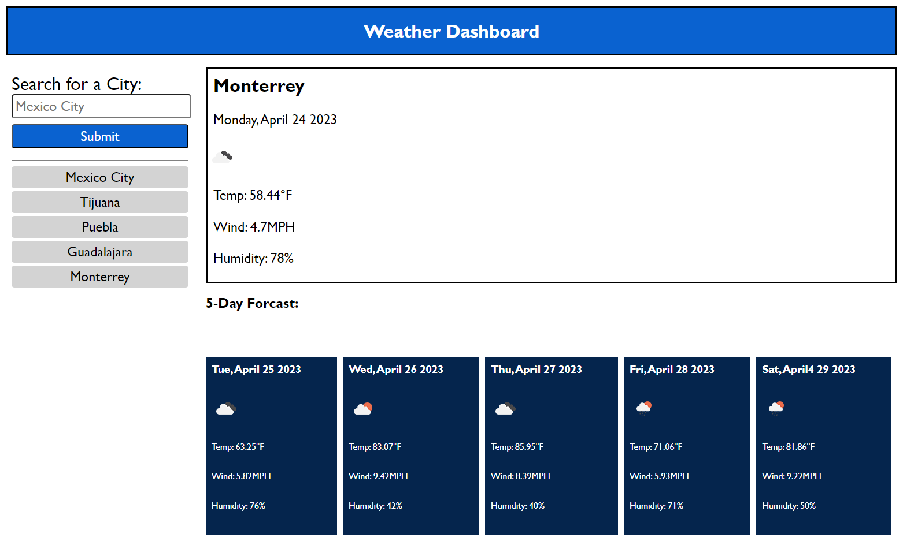

# Weather Dashboard

# Description

- The motivation behind this project was to help users plan their day according to the weather conditions
- I built this project to help people get weather infomation
- This project will help prevent cancelling events due to weather conditions
- Creating this project helped me learn how to use a third party api 

# Usage

- When the user enters a city name in the input box, weather conditions will be displayed on the dashboard
- On the dashboard, the user will get the current day and the next 5 days' weather conditions
- The user will be able get previously searched city info by clicking on the city name on the left side of the screen

Link to deployed website:[https://0mar77.github.io/weather-dashboard/]

